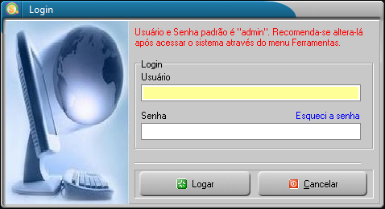
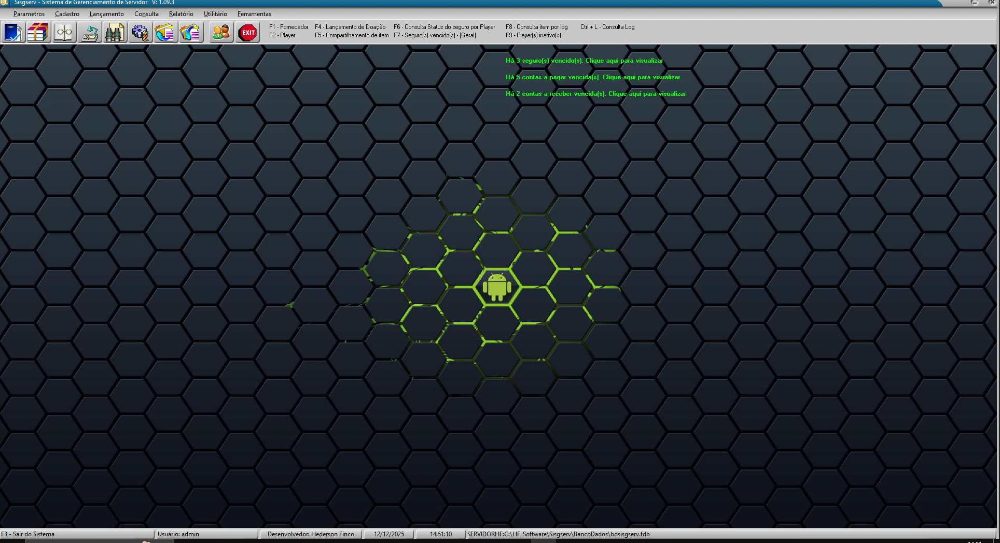

## SISGSERV
Status: Ativo desde 01/2024 
Sistema passando por refatoração   

O **SISGSERV** é um sistema **livre**, **multiusuário**, com acesso **LAN/WAN**, voltado para o controle de **doações**, incluindo **contas a pagar e a receber** integradas, além da geração de **demonstrativos de faturamento**.

### 🔗 Mais informações
- Discord: https://discord.gg/Sfvm9TMRur
- Instalador completo com banco de dados (Lado Servidor)
  https://github.com/hfsoftwaree/SisgservUpdate/releases/download/installer/Sisgserv.exe
- Instalador sem banco de dados (Lado Cliente ou quando precisar atualizar o sistema para nova versão)
  https://github.com/hfsoftwaree/SisgservUpdate/releases/download/installer/Sisgserv_a.exe

Tela de login: 
  
Tela principal: 
  

## 📋 Menus do Sistema

### 🔐 Login
- Login de usuário

---

### 🗂️ Menu Cadastro
- Cadastro de perfil de usuário
- Cadastro de servidor
- Cadastro de tipo de lançamento
- Cadastro de MOD
- Cadastro de tipo de item
- Cadastro de item
- Cadastro de banco
- Cadastro de tipo de fornecedor
- Cadastro de fornecedor
- Cadastro de player
- Cadastro de categoria
- Cadastro de subcategoria

---

### 💰 Menu Lançamento
- Lançamento de doação / ocorrências
- Lançamento de compartilhamento de veículos
- Lançamento de contas a pagar
- Lançamento de contas a receber

---

### 🔍 Menu Consulta
- Consulta status do seguro por player
- Consulta seguro vencido
- Consulta ID Log
- Consulta log de veículos
- Consulta player inativo
- Consulta demonstrativo de faturamento
- Consulta demonstrativo de resultado *(ainda será implantado)*

---

### 🛠️ Menu Utilitário
- Link direto para a página Steam Workshop
- Link direto para a página da Bohemia
- Link direto para a página dos fóruns DayZ
- Link direto para a página do Twitter do DayZ

---

### ⚙️ Menu Ferramentas
- Backup / Restore do banco de dados
- Configuração do banco de dados
- Controle de usuário
- Logoff de usuário
- Limpeza do banco de dados
- Skin

---

### ❓ Menu Ajuda
- Dicas
- Últimas atualizações
- Verificar atualizações
- Conteúdo
- Enviar e-mail para suporte
- Visitar a página da HF na internet
- Sobre o sistema

